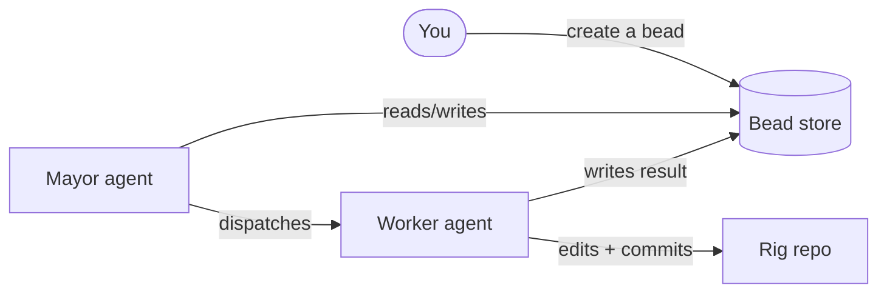
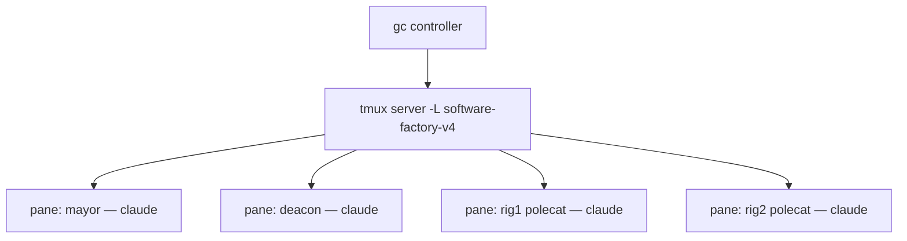
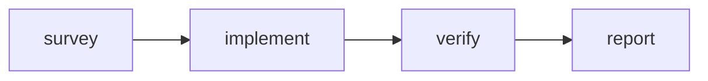

# Getting started — running the factory on your laptop

**What this is:** a plain-language walkthrough for standing up the Software
Factory prototype on a laptop, watching the fleet of Claude agents work inside
tmux, and driving a few simple runs by hand — including one small four-step
*formula*. **What this is not:** the design rationale (that's
[`PLAN.md`](PLAN.md)) or the component internals (that's [`../factory/`](../factory/)).

Everything here is hand-driven. You issue the work; you watch the agents; you
decide what happens next.

---

## The mental model (read this first)

The whole system is one **city**: a running deployment that owns a config, a set
of **agents**, a set of **rigs**, and a **bead store**.



The five words you need:

| Word | What it is |
|---|---|
| **City** | One running deployment — everything in `docker compose`. |
| **Rig** | A project directory the agents work on. This prototype ships two empty local ones (`rig1`, `rig2`). |
| **Bead** | A unit of work — like an issue, but the agents read and write them directly. Lives in the bead store. |
| **Agent** | A long-running `claude` session with a role and a scope. The city runs one per role, each in its own tmux pane. |
| **Formula** | A small recipe: a few steps wired into a graph that one agent walks top to bottom. |

The agents don't talk to each other directly — they talk **through beads**. You
give the city work by creating a bead; the agents notice it and move it along.

---

## What you need

- **Docker** — Docker Desktop on Windows (uses the WSL2 backend) or macOS, or
  Docker Engine on Linux. That's the only thing the laptop needs; the image
  builds everything else itself.
- **A Claude Pro or Max subscription.** Not an API key — a subscription. The
  agents sign in with a token minted from your subscription.

---

## Step 1 — get the code and a subscription token

```bash
git clone https://github.com/lago-morph/software-factory-prototype.git
cd software-factory-prototype
cp .env.example .env
```

Now mint the token. On the machine where you already use Claude Code, run:

```bash
claude setup-token
```

It confirms your subscription in a browser and prints a long-lived token. Paste
it into `.env` as `CLAUDE_CODE_OAUTH_TOKEN=...`. Leave `ANTHROPIC_API_KEY` empty
— that line is only for the pay-as-you-go API case, which most subscription
users never touch.

> **Windows note.** Run `git`, `claude setup-token`, and the `docker compose`
> commands in a shell where the `claude` CLI is installed (PowerShell or a WSL
> shell). The factory itself runs in Linux containers under Docker Desktop.

---

## Step 2 — bring the city up

```bash
docker compose up -d --build
```

The first build compiles Gas City (`gc`) from source and installs the rest, so
the first `up` is slow. After that the image is cached and starts quickly. Watch
it boot:

```bash
docker compose logs -f city
```

When the controller settles, check the fleet:

```bash
docker compose exec city gc status
```

You should see the city's agents — a **mayor** (the coordinator), a **deacon**
and **boot** (housekeeping), and per-rig roles (**witness**, **refinery**,
**polecat**). They start in a quiet/reserved state and wake when there's work.

---

## Step 3 — watch the agents in tmux

This is the part people find surprising: **every agent is its own live `claude`
session**, and they all run as panes under a single tmux server inside the
container. The controller starts them, watches them, and restarts any that die.



**List the running sessions** (one per agent):

```bash
docker compose exec city gc session list
# or, straight from tmux:
docker compose exec city tmux -L software-factory-v4 ls
```

**Peek at what one agent is doing** without disturbing it — this prints a
snapshot of its pane:

```bash
docker compose exec city tmux -L software-factory-v4 capture-pane -t <session-name> -p
```

**Sit on an agent's shoulder live** — attach to its pane and watch it think in
real time:

```bash
docker compose exec -it city tmux -L software-factory-v4 attach -t <session-name>
```

To leave without killing the agent, **detach**: press `Ctrl-b` then `d`. (Don't
type `exit` — that would end the agent's session.)

The `<session-name>` values come from `gc session list`. Names follow the role
(for example the mayor, or a rig's polecat worker).

---

## Tutorial — three simple runs

These build on each other. Do them in order. And a standing expectation: **the
first time you try a new kind of task, something will be off.** That's normal —
the win is how cheaply you can look at a pane, adjust, and try again, not whether
it works on the first shot.

### Run 1 — give the city a one-line task

Create a bead in a rig's scope. The mayor watches for open beads and routes
them.

```bash
docker compose exec city bash -lc \
  'cd /workspace/rigs/rig1 && gc bd create --type=task "Add a one-line description to the top of README.md"'
```

Now watch it move. In one terminal, follow the event stream:

```bash
docker compose exec city gc events --follow
```

In another, peek at the mayor's pane (find its name with `gc session list`) to
see it notice the bead and dispatch a worker. The worker wakes in the rig,
edits the file, commits, and marks the bead done.

### Run 2 — read the work graph

Everything the city did is in the bead store. Inspect it:

```bash
# all beads in rig1's scope
docker compose exec city bash -lc 'cd /workspace/rigs/rig1 && gc bd list'

# the full detail of one bead, including the worker's notes
docker compose exec city bash -lc 'cd /workspace/rigs/rig1 && gc bd show <bead-id>'
```

And confirm the actual change landed in the rig repo:

```bash
docker compose exec city bash -lc 'cd /workspace/rigs/rig1 && git --no-pager log --oneline -3'
```

### Run 3 — run a formula (the four-step recipe)

A **formula** is a small graph of steps one agent walks in order. This prototype
ships [`sf-small-task`](../pack/formulas/sf-small-task.toml):



Each box is a step the worker does in turn: understand the task, make the
change, check its own diff, then commit and report back. Confirm the city sees
it:

```bash
docker compose exec city gc formula list      # sf-small-task should appear
```

Create a task bead and **sling** it at a worker *with the formula attached* —
this is the explicit, hand-driven version of what Run 1 did automatically:

```bash
docker compose exec city bash -lc '
  cd /workspace/rigs/rig1 &&
  BEAD=$(gc bd create --type=task "Add a CONTRIBUTING note to rig1" --json | jq -r .id) &&
  gc sling rig1/polecat "$BEAD" --on sf-small-task'
```

Then attach to that polecat's pane (from `gc session list`) and watch it walk
**survey → implement → verify → report**. When it finishes, `gc bd show
<bead-id>` has the report and `git log` in the rig has the commit.

> **Want to change the recipe?** Edit
> [`pack/formulas/sf-small-task.toml`](../pack/formulas/sf-small-task.toml) —
> each `[[steps]]` block is one node, and its `needs` list is the arrows into
> it. Add a node, rebuild (`docker compose up -d --build`), and it shows up in
> `gc formula list`. The formula file *is* the graph.

---

## When things go wrong

| Symptom | Likely cause | What to do |
|---|---|---|
| Agents do nothing / error immediately | `CLAUDE_CODE_OAUTH_TOKEN` missing or stale in `.env` | Re-run `claude setup-token`, update `.env`, `docker compose restart city`. |
| Build is very slow the first time | `gc` is compiled from source | Expected once; the image is cached afterward. |
| An agent's pane looks stuck | The agent is waiting or wedged | Peek with `capture-pane`; the controller restarts dead agents on its own. |
| You want a clean slate | Old bead/rig state in the volume | `docker compose down -v`, then `up` again. |
| Bead store is **extremely slow** / "tries native store over and over" | State on a Windows/macOS host bind mount (Dolt crawls on Docker Desktop's drvfs/9p) | Make sure the compose `volumes:` uses the named volume `sfv4-workspace`, not `./workspace`. This is the default; don't change it back. |

---

## Stopping and keeping costs sane

Every agent is a live `claude` session against your subscription, and a few run
continuously for housekeeping. When you're done working:

```bash
docker compose stop city      # pause everything; your state stays in the volume
docker compose start city      # resume later, right where you left off
```

| Command | Effect |
|---|---|
| `docker compose stop city` | Pause the fleet; keep all state. |
| `docker compose down` | Stop and remove the container; the `sfv4-workspace` volume (incl. the bead store) survives. |
| `docker compose down -v` | Full reset — wipes the bead store and rigs. |

The bead store lives in the `sfv4-workspace` named volume and is never pushed
anywhere, so stopping the city never loses your work; it just goes quiet.
