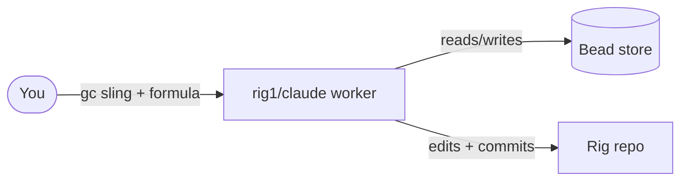
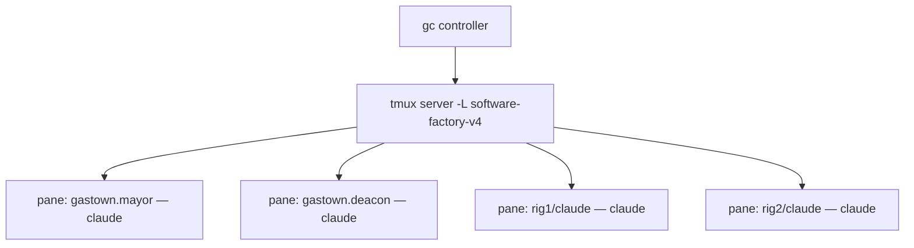
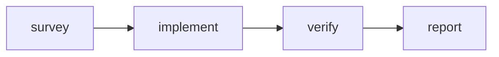

# Getting started — running the factory on your laptop

**What this is:** a plain-language walkthrough for standing up the Software
Factory prototype on a laptop, watching the fleet of Claude agents work inside
tmux, and driving a few simple runs by hand — including one small four-step
*formula*. **What this is not:** the design rationale (that's
[`PLAN.md`](PLAN.md)) or the component internals (that's [`../factory/`](../factory/)).

Everything here is hand-driven. You issue the work; you watch the agents; you
decide what happens next.

---

## The mental model (read this first)

The whole system is one **city**: a running deployment that owns a config, a set
of **agents**, a set of **rigs**, and a **bead store**.



The five words you need:

| Word | What it is |
|---|---|
| **City** | One running deployment — everything in `docker compose`. |
| **Rig** | A project directory the agents work on. This prototype ships two empty local ones (`rig1`, `rig2`). |
| **Bead** | A unit of work — like an issue, but the agents read and write them directly. Lives in the bead store. |
| **Agent** | A long-running `claude` session with a role and a scope. The city runs one per role, each in its own tmux pane. |
| **Formula** | A small recipe: a few steps wired into a graph that one agent walks top to bottom. |

**This prototype is human-driven: *you* dispatch the work.** You create a bead
and **sling** it at a rig's worker (`gc sling`), which then does the task and
records the result back in the bead store. The mayor and the other standing
agents do housekeeping — they do **not** auto-pick-up tasks you create in a rig.
A bead you create but never sling just sits `open` in the rig; nothing works it
until you sling it.

---

## What you need

- **Docker** — Docker Desktop on Windows (uses the WSL2 backend) or macOS, or
  Docker Engine on Linux. That's the only thing the laptop needs; the image
  builds everything else itself.
- **A Claude Pro or Max subscription.** Not an API key — a subscription. The
  agents sign in with a token minted from your subscription.

---

## Step 1 — get the code and a subscription token

```bash
git clone https://github.com/lago-morph/software-factory-prototype.git
cd software-factory-prototype
cp .env.example .env
```

Now mint the token. On the machine where you already use Claude Code, run:

```bash
claude setup-token
```

It confirms your subscription in a browser and prints a long-lived token. Paste
it into `.env` as `CLAUDE_CODE_OAUTH_TOKEN=...`. Leave `ANTHROPIC_API_KEY` empty
— that line is only for the pay-as-you-go API case, which most subscription
users never touch.

> **Windows note.** Run `git`, `claude setup-token`, and the `docker compose`
> commands in a shell where the `claude` CLI is installed (PowerShell or a WSL
> shell). The factory itself runs in Linux containers under Docker Desktop.

---

## Step 2 — bring the city up

```bash
docker compose up -d --build
```

The first build compiles Gas City (`gc`) from source and installs the rest, so
the first `up` is slow. After that the image is cached and starts quickly. Watch
it boot:

```bash
docker compose logs -f city
```

When the controller settles, check the fleet:

```bash
docker compose exec city gc status
```

You should see the city's agents — `gastown.mayor` (the coordinator),
`gastown.deacon` and `gastown.boot` (housekeeping), `gastown.dog`, and per-rig
agents (`rig1/claude`, `rig2/claude`, plus each rig's control-dispatcher). The
per-rig `claude` agent is the worker that does a rig's tasks.

---

## Step 3 — watch the agents in tmux

This is the part people find surprising: **every agent is its own live `claude`
session**, and they all run as panes under a single tmux server inside the
container. The controller starts them, watches them, and restarts any that die.



**List the sessions** (one per agent — note the short `ID` column, e.g. `sfv-c2d`):

```bash
docker compose exec city gc session list
```

**Peek at what one agent is doing** without disturbing it — pass the session
**id** from the list:

```bash
docker compose exec city gc session peek <session-id>      # e.g. sfv-c2d (the mayor)
```

**Sit on an agent's shoulder live** and watch it think in real time:

```bash
docker compose exec -it city gc session attach <session-id>
```

To leave without killing the agent, **detach**: press `Ctrl-b` then `d`. (Don't
type `exit` — that would end the agent's session.)

> **Going through raw tmux instead?** The tmux socket is `software-factory-v4`,
> but tmux session names aren't the dotted names `gc session list` prints — gc
> maps `.`→`__` and `/`→`--`. So `gastown.mayor` is the tmux target
> `gastown__mayor`, and `rig1/control-dispatcher` is `rig1--control-dispatcher`:
> ```bash
> docker compose exec city tmux -L software-factory-v4 ls
> docker compose exec city tmux -L software-factory-v4 capture-pane -t gastown__mayor -p
> ```
> The `gc session peek`/`attach` commands above avoid this translation, so prefer them.

---

## Tutorial — three simple runs

These build on each other. Do them in order. And a standing expectation: **the
first time you try a new kind of task, something will be off.** That's normal —
the win is how cheaply you can look at a pane, adjust, and try again, not whether
it works on the first shot.

### Run 1 — dispatch a task (create **and** sling it)

You drive the work: create a bead, then **sling** it at the rig's worker with the
`sf-small-task` formula attached. The sling does two things — it routes the bead
*and* spawns the `rig1/claude` worker (which sits at zero until there's work for
it). Run `gc bd` from the **city** dir and name the rig with `--rig`:

```bash
docker compose exec city bash -lc '
  cd /workspace/city &&
  BEAD=$(gc bd create --rig rig1 --type=task "Add a CONTRIBUTING note to rig1" --json | jq -r .id) &&
  echo "dispatched $BEAD" &&
  gc sling rig1/claude "$BEAD" --on sf-small-task'
```

(Add `--dry-run` to the `gc sling` to preview the dispatch without routing it.)

Now watch it work. The `rig1/claude` worker appears in `gc session list` within
~20s; peek it and watch it walk **survey → implement → verify → report**:

```bash
docker compose exec city gc session list                      # find the rig1/claude session id
docker compose exec city gc session peek <rig1-claude-id>     # watch it work
```

Poll the bead until it closes:

```bash
docker compose exec city bash -lc 'cd /workspace/city && gc bd show <bead-id>'
```

> **Why not just `gc bd create` and wait?** Because nothing auto-dispatches it.
> A bead you create but don't sling stays `open` in the rig scope forever — it is
> **not** lost, but no agent picks it up. (And plain `gc bd list` shows the
> *city* scope, so a rig bead won't even appear there — use `gc bd list --rig
> rig1`. That mismatch is why an un-slung bead can look like it "disappeared.")
> The mayor/deacon do housekeeping, not your task dispatch. **You** sling.
>
> A live event stream (`gc events --follow`) needs the supervisor API (`gc
> supervisor start`), which this standalone single-container deployment doesn't
> run — so `gc session peek` + polling `gc bd show` is how you watch progress.

### Run 2 — read the work graph

When the worker finishes, everything it did is in the bead store and the rig repo.

```bash
# the bead, now CLOSED, with the worker's report in its notes
docker compose exec city bash -lc 'cd /workspace/city && gc bd show <bead-id>'

# the four step-beads (survey/implement/verify/report) the formula created
docker compose exec city bash -lc 'cd /workspace/city && gc bd list --rig rig1'
```

And confirm the actual change landed as a commit in the rig repo:

```bash
docker compose exec city bash -lc 'cd /workspace/rigs/rig1 && git --no-pager log --oneline -3'
```

You should see the worker's commit (e.g. `Add CONTRIBUTING.md note to rig1`) on
top of the rig's initial commit, and a real `CONTRIBUTING.md` in the rig.

### Run 3 — understand and customize the formula

The thing that made Run 1 work is the **formula** — a small graph of steps one
agent walks in order. This prototype ships
[`sf-small-task`](../pack/formulas/sf-small-task.toml):



Each box is a step the worker does in turn: understand the task, make the change,
check its own diff, then commit and report back. Confirm the city sees it:

```bash
docker compose exec city gc formula list      # sf-small-task should appear
```

**Want to change the recipe?** Edit
[`pack/formulas/sf-small-task.toml`](../pack/formulas/sf-small-task.toml) — each
`[[steps]]` block is one node, and its `needs` list is the arrows into it. Add a
node, rebuild (`docker compose up -d --build`), and it shows up in
`gc formula list`. The formula file *is* the graph. Then dispatch another task
exactly as in Run 1 to watch your new recipe run.

---

## When things go wrong

| Symptom | Likely cause | What to do |
|---|---|---|
| Agents do nothing / error immediately | `CLAUDE_CODE_OAUTH_TOKEN` missing or stale in `.env` | Re-run `claude setup-token`, update `.env`, `docker compose restart city`. |
| Build is very slow the first time | `gc` is compiled from source | Expected once; the image is cached afterward. |
| An agent's pane looks stuck | The agent is waiting or wedged | Peek with `gc session peek <id>`; the controller restarts dead agents on its own. |
| You want a clean slate | Old bead/rig state in the volume | `docker compose down -v`, then `up` again. |
| Bead store is **extremely slow** / "tries native store over and over" | State on a Windows/macOS host bind mount (Dolt crawls on Docker Desktop's drvfs/9p) | Make sure the compose `volumes:` uses the named volume `sfv4-workspace`, not `./workspace`. This is the default; don't change it back. |

---

## Stopping and keeping costs sane

Every agent is a live `claude` session against your subscription, and a few run
continuously for housekeeping. When you're done working:

```bash
docker compose stop city      # pause everything; your state stays in the volume
docker compose start city      # resume later, right where you left off
```

| Command | Effect |
|---|---|
| `docker compose stop city` | Pause the fleet; keep all state. |
| `docker compose down` | Stop and remove the container; the `sfv4-workspace` volume (incl. the bead store) survives. |
| `docker compose down -v` | Full reset — wipes the bead store and rigs. |

The bead store lives in the `sfv4-workspace` named volume and is never pushed
anywhere, so stopping the city never loses your work; it just goes quiet.
